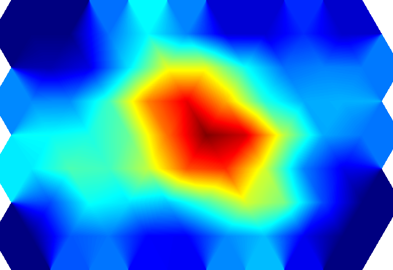

# Экспорт изображения

Цветовой растр готов к кодированию в PNG с помощью расширений Akeldov.Math.Spatial2D для
изображений.

## Сохранение и запуск

После создания `colorRaster` добавьте последние команды:

```csharp
string outputPath = Path.GetFullPath("hex-elevation.png");
colorRaster.SaveAsPng(outputPath);

Console.WriteLine(
    $"Raster: {colorRaster.Resolution.X} x {colorRaster.Resolution.Y}");
Console.WriteLine($"Saved: {outputPath}");
```

Запустите проект:

```powershell
dotnet run
```

Точное разрешение рассчитывается по границам карты, полю и заданной плотности пикселей. Программа
выведет это разрешение и абсолютный путь к `hex-elevation.png`.



На изображении процедурное поле высот плавно смешивается между центрами гексов. Поле в половину
радиуса прозрачно, а выборки у границы конечной карты нормализованы по оставшимся соседним ячейкам.

Теперь у вас есть переиспользуемый двухэтапный конвейер: индексный и барицентрический растры
описывают пространственные отношения, а растры высот и цветов можно создавать заново при изменении
данных карты или палитры. В разделе [Растры](../../concepts/data-storage/rasters.md) описаны все
семейства растров, а в разделе [Растеризация](../../concepts/rasterization.md) — прямое отображение
карты без интерполяции.
