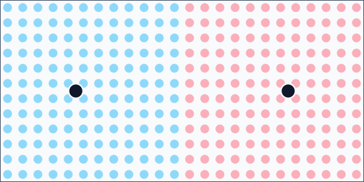
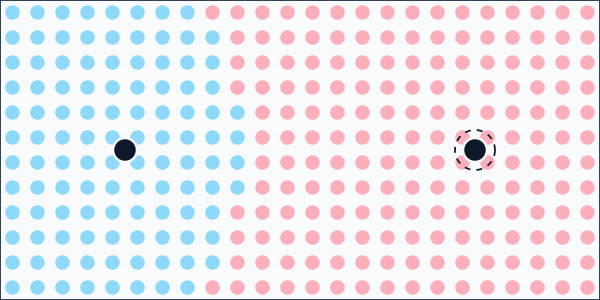

# Weighted Voronoi Partitioning

`VoronoiItemPartitioner<TItem>` assigns positioned items to the closest configured site.

Items must implement `IHasPosition2D`.

```csharp
using Akeldov.Math.Spatial2D;

public sealed class MapCell : IHasPosition2D
{
    public MapCell(string id, PointXY position)
    {
        Id = id;
        Position = position;
    }

    public string Id { get; }
    public PointXY Position { get; }
}
```

## Equal Site Weights

Use equal weights when each site should compete by distance alone.

```csharp
using System.Collections.Generic;
using Akeldov.Math.Spatial2D;
using Akeldov.Math.Spatial2D.Partitioning.Voronoi;

var sites = new[]
{
    new Site(new PointXY(25f, 30f), weight: 1f),
    new Site(new PointXY(95f, 30f), weight: 1f)
};

var partitioner = new VoronoiItemPartitioner<MapCell>(
    sites,
    EmptyCellPolicy.LeaveAsIs);

IReadOnlyList<VoronoiItemPartition<MapCell>> partitions = partitioner.Partition(items);
```



## Weighted Sites

Increase a site's `Weight` to let it claim a larger region.

```csharp
using System.Collections.Generic;
using Akeldov.Math.Spatial2D;
using Akeldov.Math.Spatial2D.Partitioning.Voronoi;

var sites = new[]
{
    new Site(new PointXY(25f, 30f), weight: 1f),
    new Site(new PointXY(95f, 30f), weight: 2f)
};

var partitioner = new VoronoiItemPartitioner<MapCell>(
    sites,
    EmptyCellPolicy.LeaveAsIs);

IReadOnlyList<VoronoiItemPartition<MapCell>> partitions = partitioner.Partition(items);
```



## Weight Edge Cases

At least one site must have positive weight.
A zero-weight site only receives items that are located at that site position.

If an item is located at a site position, that site is selected before any weighted-distance comparison.
If no site contains the item and one or more sites have `float.PositiveInfinity` weight, the nearest infinite-weight site is selected.
Otherwise, sites compete by squared distance divided by squared weight.

## Empty Cell Policies

`EmptyCellPolicy` controls how Voronoi partitions handle sites that receive no items.

Available policies:

- `ThrowException`
- `Exclude`
- `LeaveAsIs`

Use `ThrowException` when every site must receive at least one item.
Use `Exclude` when empty partitions should be removed from the semantic result.
Use `LeaveAsIs` when the result should preserve one partition per configured site.

## Centroid Relaxation

`VoronoiItemPartitioner<TItem>` can apply centroid relaxation while partitioning.

Pass `relaxationIterations` to the constructor when sites should be moved toward the centroid of their assigned items before the final result is returned.

```csharp
using System.Collections.Generic;
using Akeldov.Math.Spatial2D.Partitioning.Voronoi;

IReadOnlyList<Site> sites = LoadSites();

var partitioner = new VoronoiItemPartitioner<MapCell>(
    sites,
    relaxationIterations: 2,
    emptyCellPolicy: EmptyCellPolicy.LeaveAsIs);
```

Relaxation preserves the configured site weights. Empty partitions keep their previous site position during relaxation.

## Validation

`VoronoiItemPartitioner<TItem>` validates that:

- the site collection is not empty;
- at least one site has positive weight;
- site positions are finite;
- site weights are non-negative and not NaN;
- item collections are not empty;
- item positions are finite;
- item collections do not contain null elements.

`EmptyCellPolicy.ThrowException` rejects any empty partition. Use it when downstream code assumes every returned partition has at least one item.
