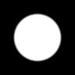
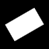

# Regions

Regions represent filled two-dimensional areas. They live in the `Akeldov.Math.Spatial2D.Regions` namespace and provide exact membership through `Contains`, unsigned boundary distance through `Distance`, and signed boundary distance through `SignedDistance`.

Signed distance is negative inside a region, zero on its boundary, and positive outside. `IContourBasedRegion` additionally exposes the contours and fill rule used to define a region.

The thumbnails below show filled-region rasterization with a short falloff outside each boundary.

## [Circular](circular/index.md)

| Region | Shape model | Notes |
|---|---|---|
|  [`Disk`](disk.md) | Center and radius | Circular filled area; converts to a `Circle` boundary. |

## [Rectangular](rectangular/index.md)

| Region | Shape model | Notes |
|---|---|---|
|  [`Rectangle`](rectangle.md) | Two opposite corners | Axis-aligned filled rectangle with normalized bounds. |
|  [`OrientedRectangle`](oriented-rectangle.md) | Center, size, and rotation | Filled rectangle whose local axes may be rotated in world space. |

## [Contour Based](contour-based/index.md)

| Region | Shape model | Notes |
|---|---|---|
|  [`ContourBasedRegion`](contour-based-regions.md) | One or more closed contours | Even-odd filling supports holes and nested areas. |

Use [contours](../contours/index.md) when only a closed boundary is needed. Use regions when area membership or a signed distance field is required.
