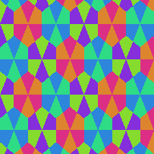

# Chromatic Rasters

Chromatic rasters sample chromatic values around hex vertices.

## `ChromaticIndexTripletRaster`

- Samples chromatic index triplets.
- Uses the same vertex triplet order as topology rasters.
- Implements the spatial raster contract directly.

```csharp
var topology = new HexMapTopology(5, 4, Layout.OddR);
var hexMapGeometry = new HexMapGeometry(topology, 1f);
var rasterGeometry = new RasterGeometry(
    new PointXY(0f, 0f),
    hexMapGeometry.GetBoundingBoxSize(),
    new VectorXYInt(192, 192));
var sourceRaster = new ChromaticIndexTripletRaster(
    hexMapGeometry,
    rasterGeometry);

SpatialRaster<RGBA16BitColor> colorRaster = sourceRaster.MapValues(ToColor);

colorRaster.SaveAsPng("chromatic-index-triplet-raster-odd-r-rgba16.png");

static RGBA16BitColor ToColor(Triplet<byte> chromatic)
{
    return new RGBA16BitColor(
        ToChannel(0.18f + 0.34f * chromatic.Main),
        ToChannel(0.18f + 0.34f * chromatic.Left),
        ToChannel(0.18f + 0.34f * chromatic.Right),
        ushort.MaxValue);
}

static ushort ToChannel(float value)
{
    value = MathF.Min(MathF.Max(value, 0f), 1f);
    return (ushort)MathF.Round(value * ushort.MaxValue);
}
```



## `ChromaticIndexPartialTripletRaster`

- Samples chromatic index triplets with presence flags.
- Handles missing neighboring cells at field boundaries.
- Supports partial triplet rasterization.
