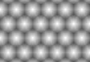
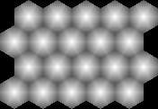

# Geometry Rasters

Geometry rasters sample Spatial2D values from a hex field.

## `BarycentricTripletRaster`

- Samples barycentric weights for vertex triplets.
- Supports geometry rasterization workflows.
- Exposes spatial raster geometry and sampled values.

```csharp
var hexGeometry = new HexMapGeometry(5, 4, VectorXY.Zero, 1f, Layout.OddR);

var sourceRaster = new BarycentricTripletRaster(
    hexGeometry,
    hexGeometry.ToRasterGeometry(16));

SpatialRaster<RGBA16BitColor> colorRaster = sourceRaster.MapValues(ToColor);

colorRaster.SaveAsPng("map.png");

static RGBA16BitColor ToColor(Triplet<float> barycentric)
{
    float main = barycentric.Main;
    return RGBA16BitColor.FromNormalized(main, main, main);
}
```



## `BarycentricPartialTripletRaster`

- Samples barycentric weights with presence flags.
- Handles missing neighboring cells at field boundaries.
- Supports rasterization of partial vertex neighborhoods.

```csharp
var hexGeometry = new HexMapGeometry(5, 4, VectorXY.Zero, 1f, Layout.OddR);

var sourceRaster = new BarycentricPartialTripletRaster(
    hexGeometry,
    hexGeometry.ToRasterGeometry(16));

SpatialRaster<RGBA16BitColor> colorRaster = sourceRaster.MapValues(ToColor);

colorRaster.SaveAsPng("map.png");

static RGBA16BitColor ToColor(PartialTriplet<float> barycentric)
{
    float main = barycentric.HasMain ? barycentric.Main : 0f;
    return RGBA16BitColor.FromNormalized(main, main, main);
}
```


