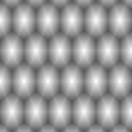

# Grids

Grids are general sampled value containers used by geometry, topology, chromatization, and rasterization APIs.

## Topics

- [`IGrid<TValue>`](grids/igrid.md)
- [Shared Grid Behavior](grids/shared-grid-behavior.md)
- [Rasterization Integration](grids/rasterization-integration.md)

## Example Outputs

Topology grids can visualize sampled index relationships.

```csharp
var grid = new IndexTripletGrid(
    hexWidth: 5,
    hexHeight: 4,
    layout: Layout.OddR,
    hexOrigin: VectorXY.Zero,
    resolution: new VectorXYInt(192, 192));

SpatialRaster<RGBA16BitColor> raster = grid.ToRGBA16BitRaster(ToColor);

raster.SaveAsPng("index-triplet-grid-odd-r-rgba16.png");

static RGBA16BitColor ToColor(Triplet<VectorXYInt> triplet)
{
    return new RGBA16BitColor(
        ToChannel(EncodeIndex(triplet.Main)),
        ToChannel(EncodeIndex(triplet.Left)),
        ToChannel(EncodeIndex(triplet.Right)),
        ushort.MaxValue);
}

static float EncodeIndex(VectorXYInt index)
{
    return 0.08f + 0.075f * (index.X + 1) + 0.12f * (index.Y + 1);
}

static ushort ToChannel(float value)
{
    value = MathF.Min(MathF.Max(value, 0f), 1f);
    return (ushort)MathF.Round(value * ushort.MaxValue);
}
```


Geometry grids can visualize sampled barycentric weights.

```csharp
var hexGeometry = new HexMapGeometry(5, 4, VectorXY.Zero, 1f, Layout.OddR);
var rasterGeometry = new RasterGeometry(
    new PointXY(-4f, -4f),
    new VectorXY(8f, 8f),
    new VectorXYInt(192, 192));
var grid = new BarycentricTripletGrid(hexGeometry, rasterGeometry);

SpatialRaster<RGBA16BitColor> raster = grid.ToRGBA16BitRaster(ToColor);

raster.SaveAsPng("barycentric-triplet-grid-main-odd-r-rgba16.png");

static RGBA16BitColor ToColor(Triplet<float> barycentric)
{
    ushort main = ToChannel(barycentric.Main);
    return new RGBA16BitColor(main, main, main, ushort.MaxValue);
}

static ushort ToChannel(float value)
{
    value = MathF.Min(MathF.Max(value, 0f), 1f);
    return (ushort)MathF.Round(value * ushort.MaxValue);
}
```



Chromatic grids can visualize sampled chromatic triplets.

```csharp
var topology = new HexMapTopology(5, 4, Layout.OddR);
var hexMapGeometry = new HexMapGeometry(topology, 1f);
var rasterGeometry = new RasterGeometry(
    new PointXY(0f, 0f),
    hexMapGeometry.GetBoundingBoxSize(),
    new VectorXYInt(192, 192));
var grid = new ChromaticIndexTripletGrid(
    hexMapGeometry,
    rasterGeometry);

SpatialRaster<RGBA16BitColor> raster = grid.ToRGBA16BitRaster(ToColor);

raster.SaveAsPng("chromatic-index-triplet-grid-odd-r-rgba16.png");

static RGBA16BitColor ToColor(Triplet<byte> chromatic)
{
    return new RGBA16BitColor(
        ToChannel(0.18f + 0.34f * chromatic.Main),
        ToChannel(0.18f + 0.34f * chromatic.Left),
        ToChannel(0.18f + 0.34f * chromatic.Right),
        ushort.MaxValue);
}

static ushort ToChannel(float value)
{
    value = MathF.Min(MathF.Max(value, 0f), 1f);
    return (ushort)MathF.Round(value * ushort.MaxValue);
}
```


