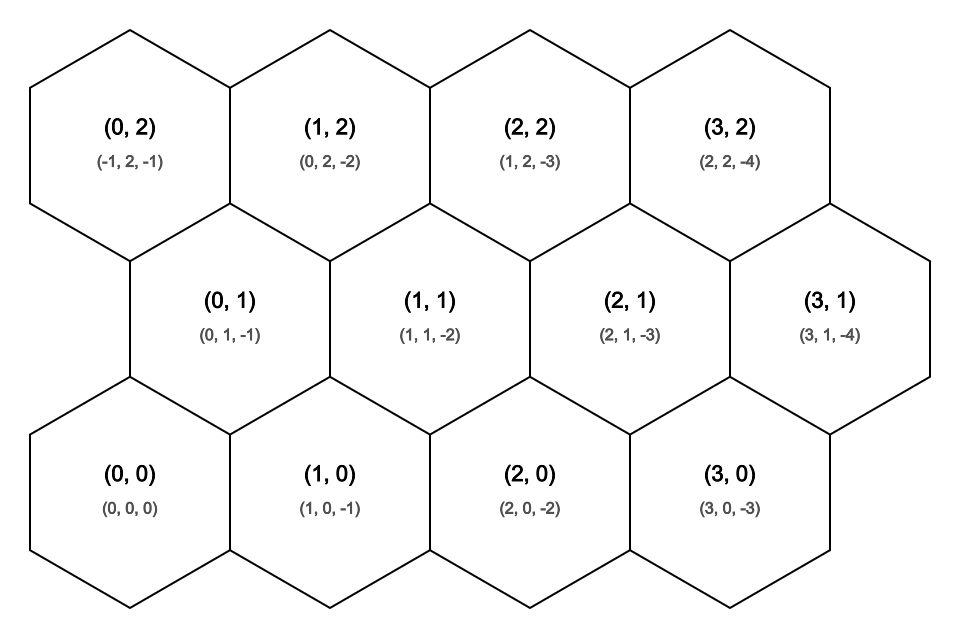
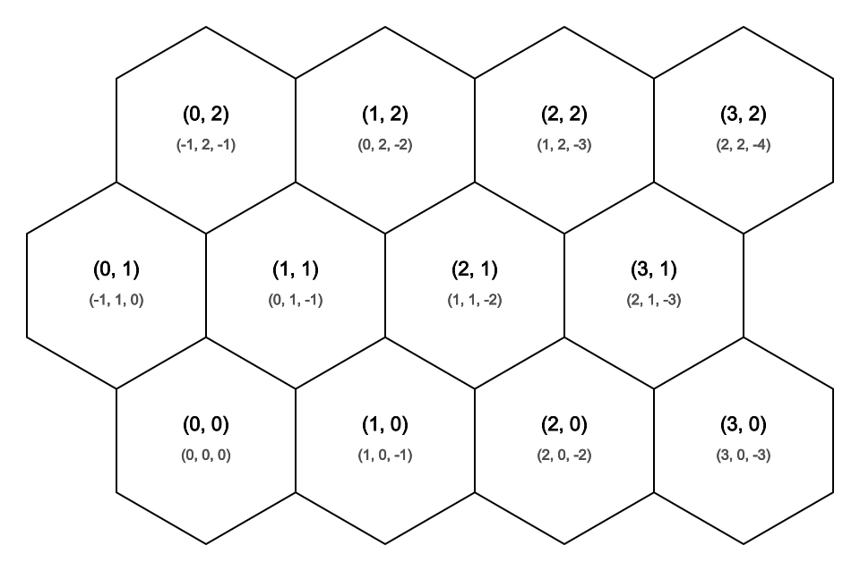
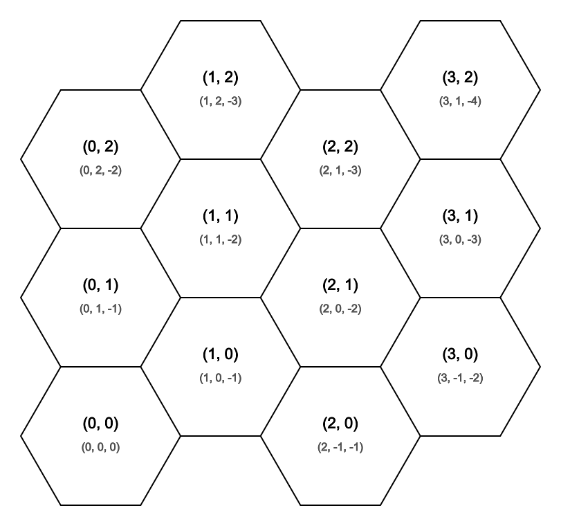
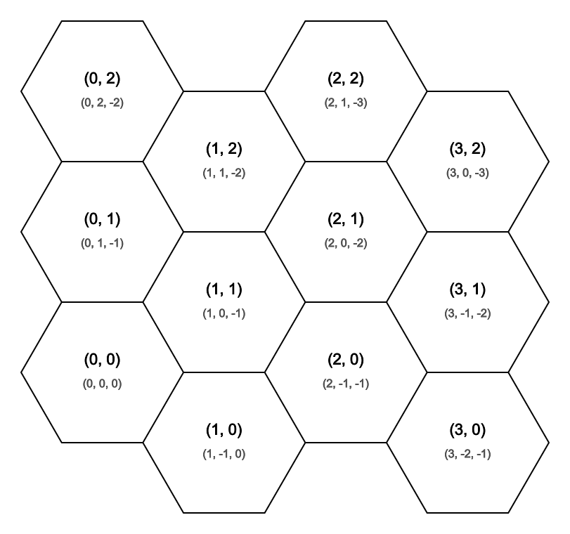

# Layouts

Layouts define how hex indexes map to rows, columns, world-space centers, and neighboring cells.

## Layout Values

`Layout` identifies the offset-coordinate convention used by a hex field.

The examples below use a 4 by 3 map so the row or column offset is visible.

### Row Layouts

#### `OddR`

- Odd row offset layout.
- Row-oriented layout.
- `HexOrientation.PointyTop`.

```csharp
TrueTypeFont font = TrueTypeFont.Load(
    Path.Combine(Environment.GetFolderPath(Environment.SpecialFolder.Fonts), "arial.ttf"));
var rasterizationOptions = new HexMapTopologyRasterizationOptions(
    30f, 1f, 1f, Gray8BitColor.Black, Gray8BitColor.White, 100);
var xyLabelsOptions = new HexMapTopologyXYLabelsRasterizationOptions(
    font, 22f, Gray8BitColor.Black, 0.8f, new VectorXY(0f, 17f));
var qrsLabelsOptions = new HexMapTopologyQRSLabelsRasterizationOptions(
    font, 16f, new Gray8BitColor(80), 0.8f, new VectorXY(0f, -17f));
var topology = new HexMapTopology(4, 3, Layout.OddR);

topology
    .Rasterize(100f, rasterizationOptions, xyLabelsOptions, qrsLabelsOptions)
    .SaveAsPng("OddR.png");
```



#### `EvenR`

- Even row offset layout.
- Row-oriented layout.
- `HexOrientation.PointyTop`.

```csharp
TrueTypeFont font = TrueTypeFont.Load(
    Path.Combine(Environment.GetFolderPath(Environment.SpecialFolder.Fonts), "arial.ttf"));
var rasterizationOptions = new HexMapTopologyRasterizationOptions(
    30f, 1f, 1f, Gray8BitColor.Black, Gray8BitColor.White, 100);
var xyLabelsOptions = new HexMapTopologyXYLabelsRasterizationOptions(
    font, 22f, Gray8BitColor.Black, 0.8f, new VectorXY(0f, 17f));
var qrsLabelsOptions = new HexMapTopologyQRSLabelsRasterizationOptions(
    font, 16f, new Gray8BitColor(80), 0.8f, new VectorXY(0f, -17f));
var topology = new HexMapTopology(4, 3, Layout.EvenR);

topology
    .Rasterize(100f, rasterizationOptions, xyLabelsOptions, qrsLabelsOptions)
    .SaveAsPng("EvenR.png");
```



### Column Layouts

#### `OddQ`

- Odd column offset layout.
- Column-oriented layout.
- `HexOrientation.FlatTop`.

```csharp
TrueTypeFont font = TrueTypeFont.Load(
    Path.Combine(Environment.GetFolderPath(Environment.SpecialFolder.Fonts), "arial.ttf"));
var rasterizationOptions = new HexMapTopologyRasterizationOptions(
    30f, 1f, 1f, Gray8BitColor.Black, Gray8BitColor.White, 100);
var xyLabelsOptions = new HexMapTopologyXYLabelsRasterizationOptions(
    font, 22f, Gray8BitColor.Black, 0.8f, new VectorXY(0f, 17f));
var qrsLabelsOptions = new HexMapTopologyQRSLabelsRasterizationOptions(
    font, 16f, new Gray8BitColor(80), 0.8f, new VectorXY(0f, -17f));
var topology = new HexMapTopology(4, 3, Layout.OddQ);

topology
    .Rasterize(100f, rasterizationOptions, xyLabelsOptions, qrsLabelsOptions)
    .SaveAsPng("OddQ.png");
```



#### `EvenQ`

- Even column offset layout.
- Column-oriented layout.
- `HexOrientation.FlatTop`.

```csharp
TrueTypeFont font = TrueTypeFont.Load(
    Path.Combine(Environment.GetFolderPath(Environment.SpecialFolder.Fonts), "arial.ttf"));
var rasterizationOptions = new HexMapTopologyRasterizationOptions(
    30f, 1f, 1f, Gray8BitColor.Black, Gray8BitColor.White, 100);
var xyLabelsOptions = new HexMapTopologyXYLabelsRasterizationOptions(
    font, 22f, Gray8BitColor.Black, 0.8f, new VectorXY(0f, 17f));
var qrsLabelsOptions = new HexMapTopologyQRSLabelsRasterizationOptions(
    font, 16f, new Gray8BitColor(80), 0.8f, new VectorXY(0f, -17f));
var topology = new HexMapTopology(4, 3, Layout.EvenQ);

topology
    .Rasterize(100f, rasterizationOptions, xyLabelsOptions, qrsLabelsOptions)
    .SaveAsPng("EvenQ.png");
```


