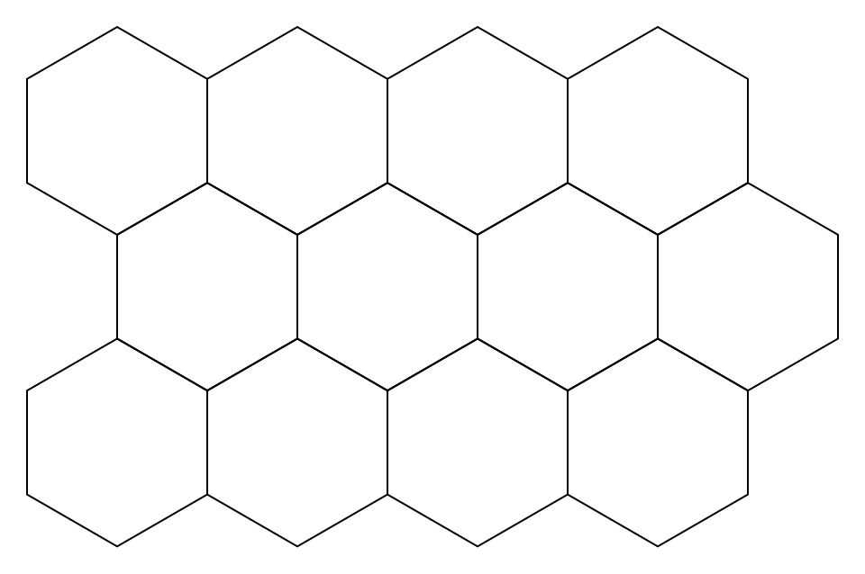
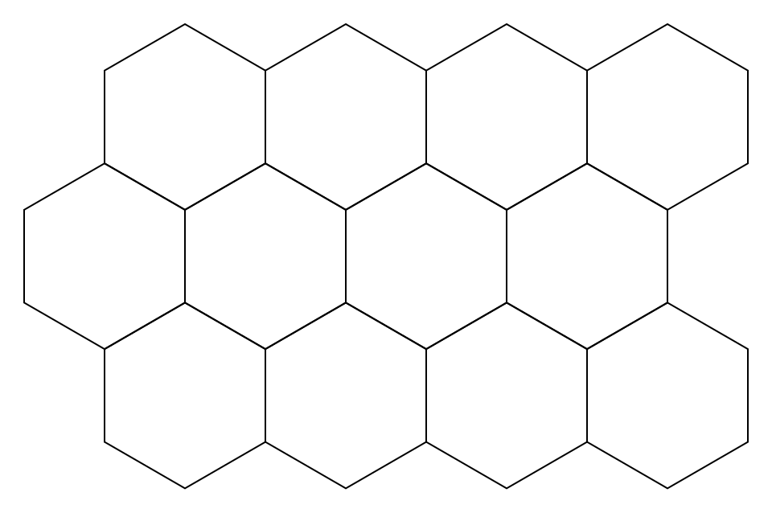
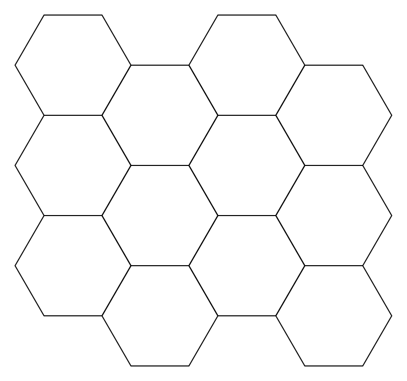
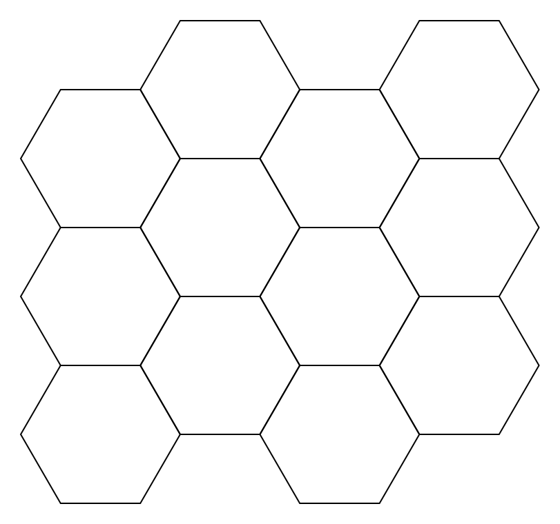

# Layouts

Layouts define how hex indexes map to rows, columns, world-space centers, and neighboring cells.

## Layout Values

`Layout` identifies the offset-coordinate convention used by a hex field.

The examples below use a 4 by 3 map so the row or column offset is visible.

### Row Layouts

#### `OddR`

- Odd row offset layout.
- Row-oriented layout.
- `HexOrientation.PointyTop`.

```csharp
new HexMapTopology(4, 3, Layout.OddR)
    .Rasterize(100f, 30f, 1f, 1f, 0, 255, 100)
    .SaveAsPng("OddR.png");
```



#### `EvenR`

- Even row offset layout.
- Row-oriented layout.
- `HexOrientation.PointyTop`.

```csharp
new HexMapTopology(4, 3, Layout.EvenR)
    .Rasterize(100f, 30f, 1f, 1f, 0, 255, 100)
    .SaveAsPng("EvenR.png");
```



### Column Layouts

#### `OddQ`

- Odd column offset layout.
- Column-oriented layout.
- `HexOrientation.FlatTop`.

```csharp
new HexMapTopology(4, 3, Layout.OddQ)
    .Rasterize(100f, 30f, 1f, 1f, 0, 255, 100)
    .SaveAsPng("OddQ.png");
```



#### `EvenQ`

- Even column offset layout.
- Column-oriented layout.
- `HexOrientation.FlatTop`.

```csharp
new HexMapTopology(4, 3, Layout.EvenQ)
    .Rasterize(100f, 30f, 1f, 1f, 0, 255, 100)
    .SaveAsPng("EvenQ.png");
```


