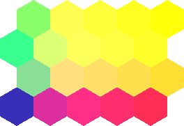
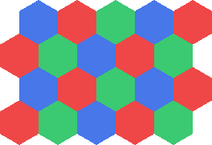

# Maps

Maps are general hex-indexed value containers. Domain-specific maps are documented with their domain pages.

## Topics

- [`IHexMap<TValue>`](maps/ihexmap.md)
- [`HexMap<TValue>`](maps/hexmap.md)
- [Shared Map Behavior](maps/shared-map-behavior.md)

## Example Outputs

`HexCenterMap` can be rasterized by mapping each hex center to a color.

```csharp
var map = new HexCenterMap(
    width: 5,
    height: 4,
    origin: VectorXY.Zero,
    apothem: 8f,
    layout: Layout.OddR);

RasterGeometry grid = HexFieldGeometryRGBA16BitRasterizer.CreateGrid(
    map,
    pixelsPerApothem: 24f);

SpatialRaster<RGBA16BitColor> raster = new HexFieldGeometryRGBA16BitRasterizer(ToColor)
    .Rasterize(map, grid);

raster.SaveAsPng("hex-center-map-odd-r-rgba16.png");

static RGBA16BitColor ToColor(PointXY center)
{
    return RGBA16BitColor.FromNormalized(
        red: 0.22f + 0.04f * center.X,
        green: 0.18f + 0.05f * center.Y,
        blue: 0.72f - 0.006f * (center.X + center.Y),
        alpha: 1f);
}
```



`ChromaticIndexMap` is a concrete map implementation that assigns repeating chromatic classes to hex indexes.

```csharp
var map = new ChromaticIndexMap(
    width: 5,
    height: 4,
    layout: Layout.OddR);

var rasterizer = new HexFieldChromatizationRGBA16BitRasterizer(
    origin: VectorXY.Zero,
    apothem: 8f,
    chromaticIndexToColor: ToColor);

RasterGeometry grid = rasterizer.CreateGrid(map, pixelsPerApothem: 24f);
SpatialRaster<RGBA16BitColor> raster = rasterizer.Rasterize(map, grid);

raster.SaveAsPng("chromatic-index-map-odd-r-rgba16.png");

static RGBA16BitColor ToColor(byte chromaticIndex)
{
    return chromaticIndex switch
    {
        0 => new RGBA16BitColor(0xefff, 0x4750, 0x4750, ushort.MaxValue),
        1 => new RGBA16BitColor(0x3b60, 0xc990, 0x72a0, ushort.MaxValue),
        2 => new RGBA16BitColor(0x4760, 0x77a0, 0xe8ff, ushort.MaxValue),
        _ => new RGBA16BitColor(0x2020, 0x2020, 0x2020, ushort.MaxValue)
    };
}
```


