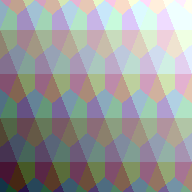

# Topology Grids

Topology grids sample index relationships into regular grid coordinates.

## Triplet Grids

- `IndexTripletGrid`.
    - Samples vertex triplets as hex indexes.
- `IndexPartialTripletGrid`.
    - Samples vertex triplets with presence flags.

```csharp
var grid = new IndexTripletGrid(
    hexWidth: 5,
    hexHeight: 4,
    layout: Layout.OddR,
    hexOrigin: VectorXY.Zero,
    resolution: new VectorXYInt(192, 192));

Raster<RGBA16BitColor> raster = grid.ToRGBA16BitRaster(ToColor);

raster.SaveAsPng("index-triplet-grid-odd-r-rgba16.png");

static RGBA16BitColor ToColor(Triplet<VectorXYInt> triplet)
{
    return new RGBA16BitColor(
        ToChannel(EncodeIndex(triplet.Main)),
        ToChannel(EncodeIndex(triplet.Left)),
        ToChannel(EncodeIndex(triplet.Right)),
        ushort.MaxValue);
}

static float EncodeIndex(VectorXYInt index)
{
    return 0.08f + 0.075f * (index.X + 1) + 0.12f * (index.Y + 1);
}

static ushort ToChannel(float value)
{
    value = MathF.Min(MathF.Max(value, 0f), 1f);
    return (ushort)MathF.Round(value * ushort.MaxValue);
}
```



## Septuplet Grids

- `IndexSeptupletGrid`.
    - Samples full neighborhood septuplets.
- `IndexPartialSeptupletGrid`.
    - Samples partial neighborhood septuplets with presence flags.

## Rasterization Support

- Topology grids can feed topology rasterization.
- Raster helpers can map index relationships into image-space samples.
