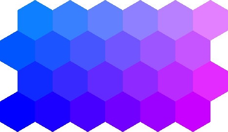
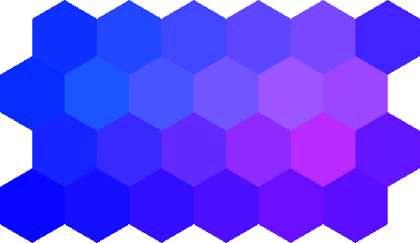

# Topology Maps

Topology maps precompute the main index and six adjacent indexes for every cell in a hex map.
The neighbor order depends on the map [`Layout`](../layouts.md), while the map geometry lets the
result be rasterized without supplying a separate placement.

## `IndexSeptupletMap`

`IndexSeptupletMap` stores a complete `Septuplet<VectorXYInt>` for every cell. Adjacent indexes are
preserved even when they lie outside the bounded map, which is useful for algorithms that handle
their own boundary rules.

The example derives one color from all six adjacent indexes. The red channel contains their
normalized X-coordinate sum, the green channel contains their normalized Y-coordinate sum, and
the blue channel stays at full intensity.

```csharp
using Akeldov.Math.Hexes;
using Akeldov.Math.Hexes.Geometry;
using Akeldov.Math.Hexes.Topology;
using Akeldov.Math.Spatial2D;
using Akeldov.Math.Spatial2D.Imaging;

var geometry = new HexMapGeometry(
    width: 6,
    height: 4,
    origin: VectorXY.Zero,
    radius: 1f,
    layout: Layout.OddR);

var map = new IndexSeptupletMap(geometry);
Septuplet<VectorXYInt> neighborhood = map[new VectorXYInt(0, 0)];

map
    .Rasterize(
        pixelsPerApothem: 36f,
        margin: 0f,
        adjacency => ToIndexColor(adjacency))
    .SaveAsPng("map.png");

static RGBA16BitColor ToIndexColor(Septuplet<VectorXYInt> septuplet)
{
    float r =
        septuplet.Adjacent0.X +
        septuplet.Adjacent1.X +
        septuplet.Adjacent2.X +
        septuplet.Adjacent3.X +
        septuplet.Adjacent4.X +
        septuplet.Adjacent5.X;
    r /= 36f;

    float g =
        septuplet.Adjacent0.Y +
        septuplet.Adjacent1.Y +
        septuplet.Adjacent2.Y +
        septuplet.Adjacent3.Y +
        septuplet.Adjacent4.Y +
        septuplet.Adjacent5.Y;
    g /= 36f;

    return RGBA16BitColor.FromNormalized(r, g, 1f);
}
```



## `IndexPartialSeptupletMap`

`IndexPartialSeptupletMap` stores a `PartialSeptuplet<VectorXYInt>`. Its `HasAdjacent0` through
`HasAdjacent5` flags report which neighbors are inside the map, so boundary handling is explicit.

The partial-map version uses the same sums but includes only neighbors whose presence flags are
set. Missing boundary neighbors therefore make no contribution to the color.

```csharp
using Akeldov.Math.Hexes;
using Akeldov.Math.Hexes.Geometry;
using Akeldov.Math.Hexes.Topology;
using Akeldov.Math.Spatial2D;
using Akeldov.Math.Spatial2D.Imaging;

var geometry = new HexMapGeometry(
    width: 6,
    height: 4,
    origin: VectorXY.Zero,
    radius: 1f,
    layout: Layout.OddR);

var map = new IndexPartialSeptupletMap(geometry);
PartialSeptuplet<VectorXYInt> neighborhood = map[new VectorXYInt(0, 0)];

map
    .Rasterize(
        pixelsPerApothem: 36f,
        margin: 0f,
        adjacency => ToIndexColor(adjacency))
    .SaveAsPng("map.png");

static RGBA16BitColor ToIndexColor(PartialSeptuplet<VectorXYInt> septuplet)
{
    float r =
        (septuplet.HasAdjacent0 ? septuplet.Adjacent0.X : 0) +
        (septuplet.HasAdjacent1 ? septuplet.Adjacent1.X : 0) +
        (septuplet.HasAdjacent2 ? septuplet.Adjacent2.X : 0) +
        (septuplet.HasAdjacent3 ? septuplet.Adjacent3.X : 0) +
        (septuplet.HasAdjacent4 ? septuplet.Adjacent4.X : 0) +
        (septuplet.HasAdjacent5 ? septuplet.Adjacent5.X : 0);
    r /= 36f;

    float g =
        (septuplet.HasAdjacent0 ? septuplet.Adjacent0.Y : 0) +
        (septuplet.HasAdjacent1 ? septuplet.Adjacent1.Y : 0) +
        (septuplet.HasAdjacent2 ? septuplet.Adjacent2.Y : 0) +
        (septuplet.HasAdjacent3 ? septuplet.Adjacent3.Y : 0) +
        (septuplet.HasAdjacent4 ? septuplet.Adjacent4.Y : 0) +
        (septuplet.HasAdjacent5 ? septuplet.Adjacent5.Y : 0);
    g /= 36f;

    return RGBA16BitColor.FromNormalized(r, g, 1f);
}
```



## Map Behavior

- Both maps implement the common spatial hex map contract.
- Both expose geometry, topology, layout, resolution, and count metadata.
- Both validate coordinate indexes before access.
- `IndexSeptupletMap` preserves all logical neighbors; `IndexPartialSeptupletMap` marks only
  in-bounds neighbors as present.
