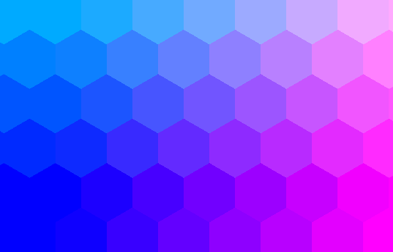
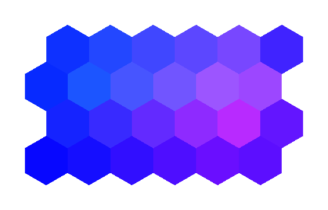

# Topology Rasters

Topology rasters sample index relationships at regular raster coordinates.

## Triplet Rasters

- `IndexTripletRaster`.
    - Samples vertex triplets as hex indexes.
- `IndexPartialTripletRaster`.
    - Samples vertex triplets with presence flags.

```csharp
var hexMapGeometry = new HexMapGeometry(5, 4, 1f, Layout.OddR);
var rasterGeometry = new RasterGeometry(
    new PointXY(0f, 0f),
    hexMapGeometry.GetBoundingBoxSize(),
    new VectorXYInt(192, 192));
var sourceRaster = new IndexTripletRaster(
    hexMapGeometry,
    rasterGeometry);

SpatialRaster<RGBA16BitColor> colorRaster = sourceRaster.MapValues(ToColor);

colorRaster.SaveAsPng("index-triplet-raster-odd-r-rgba16.png");

static RGBA16BitColor ToColor(Triplet<VectorXYInt> triplet)
{
    return new RGBA16BitColor(
        ToChannel(EncodeIndex(triplet.Main)),
        ToChannel(EncodeIndex(triplet.Left)),
        ToChannel(EncodeIndex(triplet.Right)),
        ushort.MaxValue);
}

static float EncodeIndex(VectorXYInt index)
{
    return 0.08f + 0.075f * (index.X + 1) + 0.12f * (index.Y + 1);
}

static ushort ToChannel(float value)
{
    value = MathF.Min(MathF.Max(value, 0f), 1f);
    return (ushort)MathF.Round(value * ushort.MaxValue);
}
```


## Septuplet Rasters

### `IndexSeptupletRaster`

`IndexSeptupletRaster` samples complete neighborhoods throughout its raster geometry. The raster
geometry below has a one-radius margin around the source map, so the generated colors continue
beyond the map boundary.

```csharp
using Akeldov.Math.Hexes;
using Akeldov.Math.Hexes.Geometry;
using Akeldov.Math.Hexes.Topology;
using Akeldov.Math.Spatial2D;
using Akeldov.Math.Spatial2D.Imaging;
using Akeldov.Math.Spatial2D.Rasterization;

var geometry = new HexMapGeometry(
    width: 6,
    height: 4,
    origin: VectorXY.Zero,
    radius: 1f,
    layout: Layout.OddR);
RasterGeometry rasterGeometry = geometry.ToRasterGeometry(
    pixelsPerApothem: 36f,
    margin: geometry.Radius);

var sourceRaster = new IndexSeptupletRaster(
    geometry,
    rasterGeometry);

sourceRaster
    .MapValues(ToIndexColor)
    .SaveAsPng("index-septuplet-raster.png");

static RGBA16BitColor ToIndexColor(Septuplet<VectorXYInt> septuplet)
{
    float r =
        septuplet.Adjacent0.X +
        septuplet.Adjacent1.X +
        septuplet.Adjacent2.X +
        septuplet.Adjacent3.X +
        septuplet.Adjacent4.X +
        septuplet.Adjacent5.X;
    r /= 36f;

    float g =
        septuplet.Adjacent0.Y +
        septuplet.Adjacent1.Y +
        septuplet.Adjacent2.Y +
        septuplet.Adjacent3.Y +
        septuplet.Adjacent4.Y +
        septuplet.Adjacent5.Y;
    g /= 36f;

    return RGBA16BitColor.FromNormalized(r, g, 1f);
}
```



### `IndexPartialSeptupletRaster`

`IndexPartialSeptupletRaster` uses presence flags to keep only neighborhoods whose main index is
inside the source map. The same expanded raster geometry therefore leaves the outer margin
transparent. At the map boundary, only present adjacent indexes contribute to the color.

```csharp
using Akeldov.Math.Hexes;
using Akeldov.Math.Hexes.Geometry;
using Akeldov.Math.Hexes.Topology;
using Akeldov.Math.Spatial2D;
using Akeldov.Math.Spatial2D.Imaging;
using Akeldov.Math.Spatial2D.Rasterization;

var geometry = new HexMapGeometry(
    width: 6,
    height: 4,
    origin: VectorXY.Zero,
    radius: 1f,
    layout: Layout.OddR);
RasterGeometry rasterGeometry = geometry.ToRasterGeometry(
    pixelsPerApothem: 36f,
    margin: geometry.Radius);

var sourceRaster = new IndexPartialSeptupletRaster(
    geometry,
    rasterGeometry);

sourceRaster
    .MapValues(ToIndexColor)
    .SaveAsPng("index-partial-septuplet-raster.png");

static RGBA16BitColor ToIndexColor(PartialSeptuplet<VectorXYInt> septuplet)
{
    if (!septuplet.HasMain)
        return default;

    float r =
        (septuplet.HasAdjacent0 ? septuplet.Adjacent0.X : 0) +
        (septuplet.HasAdjacent1 ? septuplet.Adjacent1.X : 0) +
        (septuplet.HasAdjacent2 ? septuplet.Adjacent2.X : 0) +
        (septuplet.HasAdjacent3 ? septuplet.Adjacent3.X : 0) +
        (septuplet.HasAdjacent4 ? septuplet.Adjacent4.X : 0) +
        (septuplet.HasAdjacent5 ? septuplet.Adjacent5.X : 0);
    r /= 36f;

    float g =
        (septuplet.HasAdjacent0 ? septuplet.Adjacent0.Y : 0) +
        (septuplet.HasAdjacent1 ? septuplet.Adjacent1.Y : 0) +
        (septuplet.HasAdjacent2 ? septuplet.Adjacent2.Y : 0) +
        (septuplet.HasAdjacent3 ? septuplet.Adjacent3.Y : 0) +
        (septuplet.HasAdjacent4 ? septuplet.Adjacent4.Y : 0) +
        (septuplet.HasAdjacent5 ? septuplet.Adjacent5.Y : 0);
    g /= 36f;

    return RGBA16BitColor.FromNormalized(r, g, 1f);
}
```



## Rasterization Support

- Topology rasters can feed topology rasterization.
- Raster helpers can map index relationships into image-space samples.
