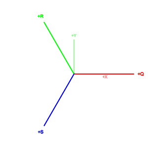
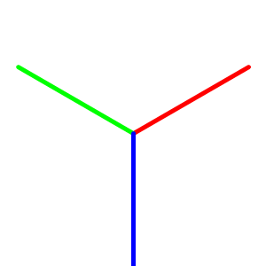

# Coordinate Conversions

Coordinate conversion helpers connect QRS coordinates, offset-storage indexes, and Spatial2D vectors. Conversions that depend on row or column offsets require a [`Layout`](../layouts.md).

## QRS and XY Indexes

`VectorQRSInt` is the layout-independent hex index. `VectorXYInt` is the corresponding row-and-column storage index:

```csharp
var qrsIndex = new VectorQRSInt(2, -1);

VectorXYInt storageIndex = qrsIndex.ToXYIndex(Layout.OddR);
VectorQRSInt restored = storageIndex.ToQRSIndex(Layout.OddR);
```

Use the same layout in both directions. `OddR` and `EvenR` offset alternating rows; `OddQ` and `EvenQ` offset alternating columns.

## Spatial2D Coordinates

`ToVectorXY` maps a fractional QRS vector onto the continuous axes of a unit-radius hex grid:

```csharp
var qrsOffset = new VectorQRS(1f, -0.5f);

VectorXY pointyTopOffset = qrsOffset.ToVectorXY(Layout.OddR);
VectorXY flatTopOffset = qrsOffset.ToVectorXY(Layout.OddQ);
```

The odd and even variants of one orientation produce the same continuous vector. Their difference matters only for offset-storage indexes.

`ToNormalizedAxial` removes a positive hex-radius scale from an already scaled QRS value:

```csharp
var scaled = new VectorQRS(24f, -12f);
VectorQRS normalized = scaled.ToNormalizedAxial(hexRadius: 12f);
```

## QRS Basis

The QRS axes are separated by 120 degrees. Red is `eQ`, green is `eR`, and blue is `eS`. Valid vectors satisfy:

```text
(Q, R, S) = Q * eQ + R * eR + S * eS
Q + R + S = 0
```

Individual basis axes are not themselves valid `VectorQRS` values because `(1, 0, 0)`, `(0, 1, 0)`, and `(0, 0, 1)` violate the zero-sum invariant. The valid differences `eQ - eS = (1, 0, -1)` and `eR - eS = (0, 1, -1)` define the plane.

### Pointy-top layouts

`OddR` and `EvenR` share the same pointy-top continuous basis:

```csharp
var p0 = new PointXY(0, 0);
VectorXY qMinusS = new VectorQRS(1, 0).ToVectorXY(Layout.OddR);
VectorXY rMinusS = new VectorQRS(0, 1).ToVectorXY(Layout.OddR);
VectorXY s = (qMinusS + rMinusS) * (-1f / 3f);
VectorXY q = qMinusS + s;
VectorXY r = rMinusS + s;
TrueTypeFont font = TrueTypeFont.Load(
    Path.Combine(Environment.GetFolderPath(Environment.SpecialFolder.Fonts), "arial.ttf"));

var scene = new GeometryScene<RGBA16BitColor>(RGBA16BitColor.White, RGBA16BitColor.AlphaOver);
var centered = new TextLayoutOptions { Anchor = TextAnchor.Center };
RGBA16BitColor xColor = RGBA16BitColor.FromNormalized(1f, 0f, 0f, 0.5f);
RGBA16BitColor yColor = RGBA16BitColor.FromNormalized(0f, 1f, 0f, 0.5f);

scene
    .AddPointDistanceBasedLayer(new ParameterizedSegment(p0, new PointXY(1f, 0f)), xColor, 0.006f, 0.006f)
    .AddPointDistanceBasedLayer(new ParameterizedSegment(p0, new PointXY(0f, 1f)), yColor, 0.006f, 0.006f)
    .AddTextLayer(font, "+X", new PointXY(0.9f, -0.08f), 0.11f, xColor, 0.01f, centered)
    .AddTextLayer(font, "+Y", new PointXY(0.08f, 0.9f), 0.11f, yColor, 0.01f, centered)
    .AddPointDistanceBasedLayer(new ParameterizedSegment(p0, p0 + q), RGBA16BitColor.Red, 0.01f, 0.01f)
    .AddPointDistanceBasedLayer(new ParameterizedSegment(p0, p0 + r), RGBA16BitColor.Green, 0.01f, 0.01f)
    .AddPointDistanceBasedLayer(new ParameterizedSegment(p0, p0 + s), RGBA16BitColor.Blue, 0.01f, 0.01f)
    .AddTextLayer(font, "+Q", p0 + q * 1.12f, 0.13f, RGBA16BitColor.Red, 0.01f, centered)
    .AddTextLayer(font, "+R", p0 + r * 1.12f, 0.13f, RGBA16BitColor.Green, 0.01f, centered)
    .AddTextLayer(font, "+S", p0 + s * 1.12f, 0.13f, RGBA16BitColor.Blue, 0.01f, centered)
    .Rasterize(new RasterGeometry(
        new PointXY(-1.25f, -1.25f),
        new VectorXY(2.5f, 2.5f),
        new VectorXYInt(300, 300)))
    .SaveAsPng("qrs-basis-pointy-top.png");
```



### Flat-top layouts

`OddQ` and `EvenQ` share the same flat-top continuous basis:

```csharp
var p0 = new PointXY(0, 0);
VectorXY qMinusS = new VectorQRS(1, 0).ToVectorXY(Layout.OddQ);
VectorXY rMinusS = new VectorQRS(0, 1).ToVectorXY(Layout.OddQ);
VectorXY s = (qMinusS + rMinusS) * (-1f / 3f);
VectorXY q = qMinusS + s;
VectorXY r = rMinusS + s;
TrueTypeFont font = TrueTypeFont.Load(
    Path.Combine(Environment.GetFolderPath(Environment.SpecialFolder.Fonts), "arial.ttf"));

var scene = new GeometryScene<RGBA16BitColor>(RGBA16BitColor.White, RGBA16BitColor.AlphaOver);
var centered = new TextLayoutOptions { Anchor = TextAnchor.Center };
RGBA16BitColor xColor = RGBA16BitColor.FromNormalized(1f, 0f, 0f, 0.5f);
RGBA16BitColor yColor = RGBA16BitColor.FromNormalized(0f, 1f, 0f, 0.5f);

scene
    .AddPointDistanceBasedLayer(new ParameterizedSegment(p0, new PointXY(1f, 0f)), xColor, 0.006f, 0.006f)
    .AddPointDistanceBasedLayer(new ParameterizedSegment(p0, new PointXY(0f, 1f)), yColor, 0.006f, 0.006f)
    .AddTextLayer(font, "+X", new PointXY(0.9f, -0.08f), 0.11f, xColor, 0.01f, centered)
    .AddTextLayer(font, "+Y", new PointXY(0.08f, 0.9f), 0.11f, yColor, 0.01f, centered)
    .AddPointDistanceBasedLayer(new ParameterizedSegment(p0, p0 + q), RGBA16BitColor.Red, 0.01f, 0.01f)
    .AddPointDistanceBasedLayer(new ParameterizedSegment(p0, p0 + r), RGBA16BitColor.Green, 0.01f, 0.01f)
    .AddPointDistanceBasedLayer(new ParameterizedSegment(p0, p0 + s), RGBA16BitColor.Blue, 0.01f, 0.01f)
    .AddTextLayer(font, "+Q", p0 + q * 1.12f, 0.13f, RGBA16BitColor.Red, 0.01f, centered)
    .AddTextLayer(font, "+R", p0 + r * 1.12f, 0.13f, RGBA16BitColor.Green, 0.01f, centered)
    .AddTextLayer(font, "+S", p0 + s * 1.12f, 0.13f, RGBA16BitColor.Blue, 0.01f, centered)
    .Rasterize(new RasterGeometry(
        new PointXY(-1.25f, -1.25f),
        new VectorXY(2.5f, 2.5f),
        new VectorXYInt(300, 300)))
    .SaveAsPng("qrs-basis-flat-top.png");
```



For a unit-radius hexagon, each component axis has length `1`, while the difference between two axes has length `sqrt(3)`, the center-to-center distance between neighboring hexagons.
