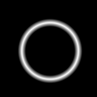
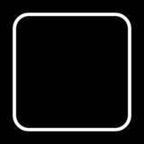

# Contours

Contours are closed boundaries made from bounded parameterized curves.
They live in the `Akeldov.Math.Spatial2D.Contours` namespace.

Each curve must continue from the previous curve, and the final curve must close the contour.

```csharp
using System;
using Akeldov.Math.Spatial2D;
using Akeldov.Math.Spatial2D.Contours;
using Akeldov.Math.Spatial2D.Curves;
using Akeldov.Math.Spatial2D.Imaging;
using Akeldov.Math.Spatial2D.Rasterization;

var contour = new CompositeContour(new IContourPath[]
{
    new ParameterizedSegment(
        new PointXY(-2f, -1.5f),
        new PointXY(1f, -1.7320508f)),
    new ParameterizedArc(
        center: new PointXY(0f, 0f),
        radius: 2f,
        startAngle: -MathF.PI / 3f,
        endAngle: 2f * MathF.PI / 3f,
        angularDirection: AngularDirection.Counterclockwise),
    new ParameterizedSegment(
        new PointXY(-1f, 1.7320508f),
        new PointXY(-2f, -1.5f))
});

bool isInside = contour.Encloses(new PointXY(3f, 0f));
```

## [Circular](circular/index.md)

The thumbnails use the same curve rasterizers as the curve overview. Non-parameterized contours show boundary distance; parameterized contours show thickness growing with the curve coordinate.

| <span class="curve-overview-heading">Non-Parameterized</span> | Parameterized | <span class="curve-coordinate-domain">Coordinate Domain</span> | Notes |
|---|---|---|---|
| <br><span class="curve-overview-link">[`Circle`](circle.md)</span> | <br><span class="curve-overview-link">[`ParameterizedCircle`](parameterized-circle.md)</span> | <span class="curve-coordinate-domain">`[0, Length]`</span> | Circular boundary; parameterized version selects a start angle and traversal direction. |

## [Rectangular](rectangular/index.md)

| <span class="curve-overview-heading">Non-Parameterized</span> | Parameterized | <span class="curve-coordinate-domain">Coordinate Domain</span> | Notes |
|---|---|---|---|
| <br><span class="curve-overview-link">[`RectangleContour`](rectangle-contour.md)</span> | <br><span class="curve-overview-link">[`ParameterizedRectangleContour`](parameterized-rectangle-contour.md)</span> | <span class="curve-coordinate-domain">`[0, Length]`</span> | Axis-aligned rectangular boundary. |
| <br><span class="curve-overview-link">[`OrientedRectangleContour`](oriented-rectangle-contour.md)</span> | <br><span class="curve-overview-link">[`ParameterizedOrientedRectangleContour`](parameterized-oriented-rectangle-contour.md)</span> | <span class="curve-coordinate-domain">`[0, Length]`</span> | Rectangular boundary with world-space rotation. |

## [Composite](composite/index.md)

| <span class="curve-overview-heading">Non-Parameterized</span> | Parameterized | <span class="curve-coordinate-domain">Coordinate Domain</span> | Notes |
|---|---|---|---|
| <br><span class="curve-overview-link">[`CompositeContour`](composite-contour.md)</span> | <br><span class="curve-overview-link">[`ParameterizedCompositeContour`](parameterized-composite-contour.md)</span> | <span class="curve-coordinate-domain">`[0, Length]`</span> | Closed chain composed from contour paths. |

Use contours for boundaries. Use [regions](../regions/index.md) when you need filled area membership.

## Smoothing

`FilletCorners` creates a new contour by trimming adjacent segment edges and inserting tangent arcs. The source contour remains unchanged.

```csharp
using Akeldov.Math.Spatial2D;
using Akeldov.Math.Spatial2D.Contours;
using Akeldov.Math.Spatial2D.Curves;
using Akeldov.Math.Spatial2D.Imaging;
using Akeldov.Math.Spatial2D.Rasterization;

var square = new CompositeContour(
    new PointXY(0f, 0f),
    new PointXY(4f, 0f),
    new PointXY(4f, 4f),
    new PointXY(0f, 4f));

CompositeContour roundedSquare = square.FilletCorners(radius: 0.5f);

var grid = new RasterGeometry(
    origin: new PointXY(-0.5f, -0.5f),
    size: new VectorXY(5f, 5f),
    resolution: new VectorXYInt(160, 160));

var contourColor = new Gray8BitColor(byte.MaxValue);

SpatialRaster<Gray8BitColor> before = square.Rasterize(
    width: 0.08f,
    edgeFalloff: 0.04f,
    color: contourColor,
    rasterGeometry: grid);

SpatialRaster<Gray8BitColor> after = roundedSquare.Rasterize(
    width: 0.08f,
    edgeFalloff: 0.04f,
    color: contourColor,
    rasterGeometry: grid);
```

| Before | After |
|---|---|
|  |  |

The radius is expressed in world coordinate units. Smoothing is applied where two adjacent `ParameterizedSegment` edges meet; other curve types are preserved.
