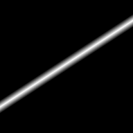
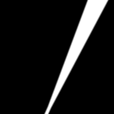
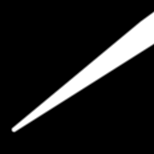

# Curves

Curves describe one-dimensional geometry in 2D space: infinite lines, half-lines, bounded segments, and arcs.
They live in the `Akeldov.Math.Spatial2D.Curves` namespace and are used by contours, regions, fields, and rasterizers.

Every `ICurve` can measure point distance and project a point onto itself. Supported concrete curve types
report binary intersections through extension methods, while contour paths and contours expose
polymorphic ray intersections through `IRayIntersectionProvider`.
Parameterized curves additionally expose a length-based curve coordinate through `GetPoint` and `ProjectWithParameter`.
For open polylines, [`ParameterizedSegmentChain`](linear/parameterized-segment-chain.md) composes consecutive directed segments behind one finite-path API.

Angles are expressed in radians by default. Degree-based members use the `Deg` suffix.

The table thumbnails are produced by the curve rasterizers.
Non-parameterized thumbnails show distance rasters; parameterized thumbnails show curve-coordinate-driven growing thickness.

| Non-Parameterized | Parameterized | Coordinate Domain | Notes |
|---|---|---|---|
|  [`Line`](linear/line.md) |  [`ParameterizedLine`](linear/parameterized-line.md) | `(-inf, +inf)` | Infinite line; parameterized version adds origin and direction. |
| - |  [`Ray`](linear/ray.md) | `[0, +inf)` | Half-line, inherently directed from its origin. |
|  [`Segment`](linear/segment.md) |  [`ParameterizedSegment`](linear/parameterized-segment.md) | `[0, Length]` | `Segment` is endpoint-order agnostic; `ParameterizedSegment` has start/end direction. |
|  [`Arc`](circular/arc.md) |  [`ParameterizedArc`](circular/parameterized-arc.md) | `[0, Length]` | Bounded angular span; parameterized version adds traversal direction. |
| - |  [`QuadraticBezier`](bezier/quadratic-bezier.md) | `[0, Length]` | TrueType-style Bezier segment with one control point. |
| - |  [`CubicBezier`](bezier/cubic-bezier.md) | `[0, Length]` | Four-point Bezier segment commonly used by vector drawing formats. |

`Line` and `ParameterizedLine` can also be constructed from a point and direction angle in radians.
Bezier curve types implement `IFinitePath`, so they can be used anywhere a directed bounded curve is expected.
Their `GetPointAt` methods use the normalized Bezier parameter `t` in the `[0, 1]` range, while `GetPoint`
uses the library's length-based curve coordinate.

## Topics

- [Linear Curves](linear/index.md)
- [Circular Curves](circular/index.md)
- [Bezier Curves](bezier/index.md)
- [Curve Interfaces](curve-interfaces.md)
- [Projections and Distances](projections-and-distances.md)
- [Intersections](intersections.md)
