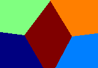
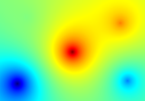
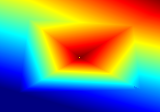

# Sampling Strategies

Sampling defines how selected sources contribute to the final value at a point.

The example below uses the same source layout and raster grid as the influence heatmap snapshot tests.
It creates one heatmap for each sampling strategy shown on this page.

```csharp
using Akeldov.Math.Spatial2D;
using Akeldov.Math.Spatial2D.Fields;
using Akeldov.Math.Spatial2D.Imaging;
using Akeldov.Math.Spatial2D.Rasterization;

var grid = new SpatialRasterGrid(
    origin: new PointXY(0f, 0f),
    size: new VectorXY(100f, 70f),
    resolution: new VectorXYInt(160, 112));

var sources = new[]
{
    new FloatPointInfluenceSource(1f, new PointXY(12f, 12f), 0f),
    new FloatPointInfluenceSource(1f, new PointXY(88f, 14f), 25f),
    new FloatPointInfluenceSource(1f, new PointXY(18f, 58f), 50f),
    new FloatPointInfluenceSource(1f, new PointXY(83f, 54f), 75f),
    new FloatPointInfluenceSource(1f, new PointXY(50f, 34f), 100f)
};

var nearestSampler = new NearestFloatInfluenceSampler<FloatPointInfluenceSource>();
new FloatPointInfluenceField(nearestSampler, sources)
    .RasterizeHeatMap(grid)
    .SaveAsPng("nearest-heatmap.png");

var inverseDistanceWeightedSampler = new InverseDistanceWeightedFloatSampler<FloatPointInfluenceSource>();
new FloatPointInfluenceField(inverseDistanceWeightedSampler, sources)
    .RasterizeHeatMap(grid)
    .SaveAsPng("inverse-distance-weighted-heatmap.png");

var barycentricSampler = new BarycentricFloatSampler<FloatPointInfluenceSource>();
new FloatPointInfluenceField(barycentricSampler, sources)
    .RasterizeHeatMap(grid)
    .SaveAsPng("barycentric-heatmap.png");
```

## Nearest Sampling

Nearest sampling returns the value of the closest source.



## Inverse-Distance Weighted Sampling

Inverse-distance weighted sampling blends all selected sources, weighted by distance and source weight.



## Barycentric Sampling

Barycentric sampling interpolates over nearby source triangles.


