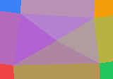

# Source Culling

Culling selects a local subset of sources before the sampler computes a value.
This is useful when the field should be driven by nearby geometric neighborhoods instead of every source.

The example below uses the same source layout, colors, and raster grid as the culling map snapshot tests.
It writes rasters where each cell is colored by the sources selected by a culler at that cell center.

```csharp
using System.Collections.Generic;
using Akeldov.Math.Spatial2D;
using Akeldov.Math.Spatial2D.Fields;
using Akeldov.Math.Spatial2D.Imaging;
using Akeldov.Math.Spatial2D.Rasterization;

var grid = new RasterGrid(
    origin: new PointXY(0f, 0f),
    size: new VectorXY(100f, 70f),
    resolution: new VectorXYInt(160, 112));

var sources = new[]
{
    new FloatPointInfluenceSource(1f, new PointXY(12f, 12f), 0f),
    new FloatPointInfluenceSource(1f, new PointXY(88f, 14f), 25f),
    new FloatPointInfluenceSource(1f, new PointXY(18f, 58f), 50f),
    new FloatPointInfluenceSource(1f, new PointXY(83f, 54f), 75f),
    new FloatPointInfluenceSource(1f, new PointXY(50f, 34f), 100f)
};

var sourceColors = new Dictionary<PointXY, RGBA16BitColor>
{
    { sources[0].Position, new RGBA16BitColor(0xefef, 0x4444, 0x4444, 0xffff) },
    { sources[1].Position, new RGBA16BitColor(0x2222, 0xc5c5, 0x5e5e, 0xffff) },
    { sources[2].Position, new RGBA16BitColor(0x3b3b, 0x8282, 0xf6f6, 0xffff) },
    { sources[3].Position, new RGBA16BitColor(0xf5f5, 0x9e9e, 0x0b0b, 0xffff) },
    { sources[4].Position, new RGBA16BitColor(0xa8a8, 0x5555, 0xf7f7, 0xffff) }
};

var halfPlaneCuller = new HalfPlaneCuller<FloatPointInfluenceSource>(sources);
sources
    .RasterizeCullingMap(grid, halfPlaneCuller, point => sourceColors[point])
    .SaveAsPng("half-plane-culling-map.png");

var delaunayCuller = new DelaunayCuller<FloatPointInfluenceSource>(sources);
sources
    .RasterizeCullingMap(grid, delaunayCuller, point => sourceColors[point])
    .SaveAsPng("delaunay-culling-map.png");
```

## Half-Plane Culling

`HalfPlaneCuller<TPointSource>` orders sources by distance from the sampled point and excludes sources hidden behind half-plane boundaries created by nearer sources.


## Delaunay Culling

`DelaunayCuller<TPointSource>` selects the Delaunay triangle containing the sampled point.
Outside the triangulated area, it falls back to the nearest convex hull feature.



The current culler implementation uses float geometry with the library geometry tolerance.
It builds the triangulation up front, then checks triangles linearly for each sampled point.
