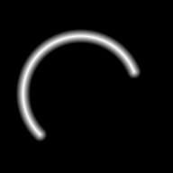

# Arc

`Arc` represents a bounded part of a circle.

The `startAngle` and `endAngle` constructor arguments, plus the `StartAngle` and `EndAngle` properties, are in radians.
Stored angles are normalized.

This code uses the same arc, raster grid, and distance mapping as the approved snapshot image below.

```csharp
using System;
using Akeldov.Math.Spatial2D;
using Akeldov.Math.Spatial2D.Curves;
using Akeldov.Math.Spatial2D.Imaging;
using Akeldov.Math.Spatial2D.Rasterization;

var arc = new Arc(
    center: new PointXY(-0.2f, -0.25f),
    radius: 2f,
    startAngle: MathF.PI / 8f,
    endAngle: 5f * MathF.PI / 4f);

var grid = new RasterGrid(
    origin: new PointXY(-3f, -3f),
    size: new VectorXY(6f, 6f),
    resolution: new VectorXYInt(96, 96));

var rasterizer = new CurveDistanceGray8BitRasterizer(distance =>
{
    const float falloffDistance = 0.25f;
    float normalized = 1f - Math.Clamp(distance / falloffDistance, 0f, 1f);
    return (byte)MathF.Round(normalized * byte.MaxValue);
});

Gray8BitRaster raster = arc.Rasterize(grid, rasterizer);
raster.SaveAsPng("arc-distance.png");
```



When a point's direction from the center is inside the arc's angular region, projection lands on the source circle.
When the direction is outside the angular region, projection clamps to the nearest endpoint.

```csharp
var arc = new Arc(
    center: new PointXY(0f, 0f),
    radius: 5f,
    startAngle: 0f,
    endAngle: MathF.PI / 2f);

bool isInsideArcAngle = arc.IsWithinAngularRegion(new PointXY(1f, 1f));
PointXY start = arc.StartPoint; // (5, 0)
PointXY end = arc.EndPoint;     // (0, 5)

CurveProjection projection = arc.Project(new PointXY(-3f, 4f));
```

Equal input angles create a zero-length arc at the start point.
An end angle one full turn after the start angle creates a full circle, even though normalized start and end angles are equal.
