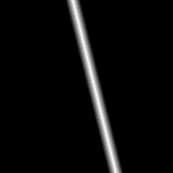
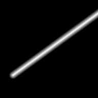

# Curves

Curves describe one-dimensional geometry in 2D space: infinite lines, half-lines, bounded segments, circles, and arcs.
They live in the `Akeldov.Math.Spatial2D.Curves` namespace and are used by contours, regions, fields, and rasterizers.

Every curve can measure point distance, project a point onto itself, and report intersections with a ray.
Parameterized curves additionally expose a length-based curve coordinate through `GetPoint` and `ProjectWithParameter`.

Angles are expressed in radians by default. Degree-based members use the `Deg` suffix.

The images below are distance rasters produced by the curve rasterizers: bright pixels are close to the curve and dark pixels are farther away.

| Non-Parameterized | Parameterized | Coordinate Domain | Notes |
|---|---|---|---|
| [`Line`](line.md) | [`ParameterizedLine`](parameterized-line.md) | `(-inf, +inf)` | Infinite line; parameterized version adds origin and direction. |
| - | [`Ray`](ray.md) | `[0, +inf)` | Half-line, inherently directed from its origin. |
| [`Segment`](segment.md) | [`ParameterizedSegment`](parameterized-segment.md) | `[0, Length]` | `Segment` is endpoint-order agnostic; `ParameterizedSegment` has start/end direction. |
| [`Circle`](circle.md) | - | - | Full circumference; distance/projection is to the ring, not a filled disk. |
| [`Arc`](arc.md) | [`ParameterizedArc`](parameterized-arc.md) | `[0, Length]` | Bounded angular span; parameterized version adds traversal direction. |

  
  
  
  
  

## Topics

- [Curve Interfaces](curve-interfaces.md)
- [Projections and Distances](projections-and-distances.md)
- [Intersections](intersections.md)
