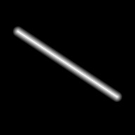

# Segment

`Segment` is a finite curve between two endpoints.
It is endpoint-order agnostic, but endpoint inclusion is still preserved.

Use `Segment` when endpoint order should not matter and you only need geometric operations.

This code uses the same segment, raster grid, and distance mapping as the approved snapshot image below.

```csharp
using System;
using Akeldov.Math.Spatial2D;
using Akeldov.Math.Spatial2D.Curves;
using Akeldov.Math.Spatial2D.Imaging;
using Akeldov.Math.Spatial2D.Rasterization;

var segment = new Segment(
    startPoint: new PointXY(-2.2f, 1.6f),
    endPoint: new PointXY(2.2f, -1.3f));

var grid = new RasterGrid(
    origin: new PointXY(-3f, -3f),
    size: new VectorXY(6f, 6f),
    resolution: new VectorXYInt(96, 96));

var rasterizer = new CurveDistanceGray8BitRasterizer(distance =>
{
    const float falloffDistance = 0.25f;
    float normalized = 1f - Math.Clamp(distance / falloffDistance, 0f, 1f);
    return (byte)MathF.Round(normalized * byte.MaxValue);
});

Gray8BitRaster raster = segment.Rasterize(grid, rasterizer);
raster.SaveAsPng("segment-distance.png");
```



Endpoint inclusion matters for ray intersections at exact endpoints.

```csharp
var closed = new Segment(
    startPoint: new PointXY(0f, 0f),
    endPoint: new PointXY(10f, 0f));

var openAtStart = new Segment(
    startPoint: new PointXY(0f, 0f),
    endPoint: new PointXY(10f, 0f),
    includesEndpointA: false,
    includesEndpointB: true);

CurveProjection projection = closed.Project(new PointXY(4f, 3f));
Segment shorter = closed.Shorten(1f);
Segment longer = closed.Extend(2f);
```

Degenerate segments are allowed. For a zero-length `Segment`, projection returns the endpoint.

Use [`ParameterizedSegment`](parameterized-segment.md) when you need traversal direction or a coordinate from start to end.
