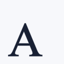

# Text Layers

`GeometryScene<RGBA16BitColor>` can render TrueType text as a signed-distance layer.
Use `TrueTypeFont.Load(...)` to read a `.ttf` file, then add the text with
`AddTextLayer`.

The text origin, `fontSize`, `edgeFalloff`, `LetterSpacing`, and `LineSpacing`
are all measured in world coordinate units. `fontSize` is the font em size in
scene coordinates, so a `fontSize` of `6f` means one font em is six world units
tall before glyph-specific ascenders and descenders are applied.

The example below assumes that an open-licensed font is bundled with the
application at `fonts/Tinos-Regular.ttf`.

```csharp
using Akeldov.Math.Spatial2D;
using Akeldov.Math.Spatial2D.Imaging;
using Akeldov.Math.Spatial2D.Rasterization;

var grid = new SpatialRasterGrid(
    origin: new PointXY(0f, 0f),
    size: new VectorXY(8f, 8f),
    resolution: new VectorXYInt(128, 128));

TrueTypeFont font = TrueTypeFont.Load("fonts/Tinos-Regular.ttf");

RGBA16BitColor background = RGBA16BitColor.FromNormalized(0.965f, 0.972f, 0.982f, 1f);
RGBA16BitColor textColor = RGBA16BitColor.FromNormalized(0.055f, 0.085f, 0.165f, 0.95f);

SpatialRaster<RGBA16BitColor> raster = new GeometryScene<RGBA16BitColor>(
        background,
        RGBA16BitColor.AlphaOver)
    .AddTextLayer(
        font,
        "A",
        origin: new PointXY(1f, 1f),
        fontSize: 6f,
        color: textColor,
        edgeFalloff: 0.08f)
    .Rasterize(grid);

raster.SaveAsPng("text.png");
```



The RGBA overload fills the inside of the text outline with `color` and fades
outside the outline across `edgeFalloff`. It uses the scene's default blend
function, so text can be composited with regions, curves, points, and other
scene layers.

## Layout Options

The default anchor is `TextAnchor.BaselineLeft`: the origin is placed at the
left edge of the first line's baseline. Other anchors can align the visible
text bounds by top, center, bottom, left, center, or right.

```csharp
var layout = new TextLayoutOptions
{
    Anchor = TextAnchor.Center,
    LetterSpacing = 0.15f,
    LineSpacing = 0.75f,
    UseKerning = true
};

SpatialRaster<RGBA16BitColor> centered = new GeometryScene<RGBA16BitColor>(
        background,
        RGBA16BitColor.AlphaOver)
    .AddTextLayer(
        font,
        "Line 1\nLine 2",
        origin: new PointXY(32f, 24f),
        fontSize: 5f,
        color: textColor,
        edgeFalloff: 0.1f,
        layout)
    .Rasterize(new SpatialRasterGrid(
        origin: new PointXY(0f, 0f),
        size: new VectorXY(64f, 48f),
        resolution: new VectorXYInt(512, 384)));
```

`LetterSpacing` is added after each glyph advance except the last glyph in a
line. `LineSpacing` is added to the font line advance between text lines.
When `UseKerning` is enabled, legacy TrueType kerning pairs are applied if the
font provides them.

## Custom Distance Mapping

For non-RGBA output or custom styling, use the generic overload that maps
signed distance to a color value. Negative distances are inside the text
outline, positive distances are outside it.

```csharp
var outlineGrid = new SpatialRasterGrid(
    origin: new PointXY(0f, 0f),
    size: new VectorXY(32f, 16f),
    resolution: new VectorXYInt(512, 256));

SpatialRaster<RGBA16BitColor> outlined = new GeometryScene<RGBA16BitColor>(
        background,
        RGBA16BitColor.AlphaOver)
    .AddTextLayer(
        font,
        "SDF",
        origin: new PointXY(4f, 8f),
        fontSize: 10f,
        signedDistanceToColor: distance =>
        {
            if (distance <= 0f)
                return textColor;

            if (distance <= 0.25f)
                return RGBA16BitColor.FromNormalized(0.95f, 0.2f, 0.1f, 1f);

            return RGBA16BitColor.Transparent;
        })
    .Rasterize(outlineGrid);
```

## Font Files

The renderer reads TrueType `.ttf` files with `glyf` outlines. It does simple
glyph layout from the font's metrics and optional legacy kerning pairs.

For repeatable tests, examples, and documentation builds, prefer a font file
that is explicitly included with your project under a suitable license. System
fonts are useful for local rendering, but their availability and exact version
can vary across machines and CI images. Do not redistribute copied system font
files unless their license allows it.
