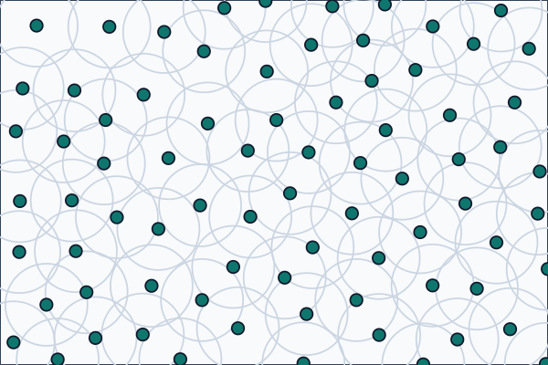

# Poisson Disk Sampling

`PoissonDiskPointSampler` generates points in a rectangular 2D field while keeping a minimum distance between accepted samples.

## Constant Minimal Distance

Use a single minimal distance when the whole field should have the same sample density.

```csharp
using System;
using System.Collections.Generic;
using Akeldov.Math.Spatial2D;
using Akeldov.Math.Spatial2D.Sampling.Point.PoissonDisk;

var sampler = new PoissonDiskPointSampler(new Random(12345), maxAttempts: 30);

List<PoissonDiskPointSample> samples =
    sampler.Sample(new VectorXY(120f, 80f), minimalDistance: 9f);
```

The returned list is new, mutable, and owned by the caller.



## Variable Minimal Distance

Pass an `IFloatField` when the minimal distance should depend on the sampled position.
The following example uses the same seed, field size, distance field, raster grid, and color mapping as the approved rasterization snapshot test.

```csharp
using System;
using System.Collections.Generic;
using System.IO;
using Akeldov.Math.Spatial2D;
using Akeldov.Math.Spatial2D.Fields;
using Akeldov.Math.Spatial2D.Imaging;
using Akeldov.Math.Spatial2D.Rasterization;
using Akeldov.Math.Spatial2D.Sampling.Point.PoissonDisk;

var fieldSize = new VectorXY(120f, 80f);
var grid = new RasterGrid(
    origin: new PointXY(0f, 0f),
    size: fieldSize,
    resolution: new VectorXYInt(180, 120));

var sampler = new PoissonDiskPointSampler(new Random(12345), maxAttempts: 30);
var distanceField = new HorizontalDistanceField(min: 5f, max: 13f, width: fieldSize.X);

List<PoissonDiskPointSample> samples =
    sampler.Sample(fieldSize, distanceField);

RGBA16BitRaster raster = samples.Rasterize(grid, ToSnapshotColor);
Directory.CreateDirectory("artifacts");
raster.SaveAsPng(Path.Combine("artifacts", "poisson-disk-samples-rgba16.png"));

static RGBA16BitColor ToSnapshotColor(PoissonDiskPointSample sample, float distance)
{
    float distanceT = MathF.Min(distance / sample.MinimalDistance, 1f);
    float distanceFill = (1f - distanceT) * 0.55f;
    float radiusT = MathF.Min(MathF.Max((sample.MinimalDistance - 5f) / 8f, 0f), 1f);

    Rgb background = new Rgb(0.972f, 0.980f, 0.988f);
    Rgb smallDistance = new Rgb(0.125f, 0.510f, 0.965f);
    Rgb largeDistance = new Rgb(0.961f, 0.620f, 0.043f);
    Rgb diskColor = Blend(smallDistance, largeDistance, radiusT);
    Rgb color = Blend(background, diskColor, distanceFill);

    float pointAmount = MathF.Max(0f, 1f - distance / 1.15f);
    return Blend(color, new Rgb(0.058f, 0.090f, 0.165f), pointAmount)
        .ToRGBA16BitColor();
}

static Rgb Blend(Rgb from, Rgb to, float amount)
{
    amount = MathF.Min(MathF.Max(amount, 0f), 1f);
    float inverseAmount = 1f - amount;

    return new Rgb(
        from.Red * inverseAmount + to.Red * amount,
        from.Green * inverseAmount + to.Green * amount,
        from.Blue * inverseAmount + to.Blue * amount);
}

readonly struct Rgb
{
    public Rgb(float red, float green, float blue)
    {
        Red = red;
        Green = green;
        Blue = blue;
    }

    public float Red { get; }

    public float Green { get; }

    public float Blue { get; }

    public RGBA16BitColor ToRGBA16BitColor()
    {
        return new RGBA16BitColor(ToChannel(Red), ToChannel(Green), ToChannel(Blue), ushort.MaxValue);
    }

    private static ushort ToChannel(float value)
    {
        value = MathF.Min(MathF.Max(value, 0f), 1f);
        return (ushort)MathF.Round(value * ushort.MaxValue);
    }
}

public sealed class HorizontalDistanceField : IFloatField
{
    private readonly float _min;
    private readonly float _max;
    private readonly float _width;

    public HorizontalDistanceField(float min, float max, float width)
    {
        _min = min;
        _max = max;
        _width = width;
    }

    public float Min => _min;
    public float Max => _max;

    public float Sample(PointXY point)
    {
        float t = point.X / _width;
        t = MathF.Max(0f, MathF.Min(1f, t));
        return _min + (_max - _min) * t;
    }
}
```


The ring view below is the companion approved test image. Each ring marks the local minimal distance around a generated sample.


## Tuning

`maxAttempts` controls how many candidates are tried around an active point before the sampler retires that point.
Higher values can produce denser point sets, but take more work.

The minimal distance must always be positive.
If a field returns zero or a negative value for a sampled point, sampling fails with an exception.
