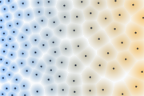

# Poisson Disk Sampling

`PoissonDiskPointSampler` generates points in a rectangular 2D field while keeping a minimum distance between accepted samples.

## Distance Color Raster

```csharp
using System;
using Akeldov.Math.Spatial2D;
using Akeldov.Math.Spatial2D.Fields;
using Akeldov.Math.Spatial2D.Imaging;
using Akeldov.Math.Spatial2D.Rasterization;
using Akeldov.Math.Spatial2D.Sampling.Point.PoissonDisk;

var fieldSize = new VectorXY(120f, 80f);
var grid = new RasterGrid(new PointXY(0f, 0f), fieldSize, new VectorXYInt(180, 120));

var sampler = new PoissonDiskPointSampler(new Random(45678), maxAttempts: 30);
var distanceField = new FloatPointInfluenceField(
    new BarycentricFloatSampler<FloatPointInfluenceSource>(),
    new[]
    {
        new FloatPointInfluenceSource(1f, new PointXY(0f, 0f), 5f),
        new FloatPointInfluenceSource(1f, new PointXY(fieldSize.X, 0f), 13f)
    });

var samples = sampler.Sample(fieldSize, distanceField);

var background = RGBA16BitColor.FromNormalized(0.972f, 0.980f, 0.988f);
var smallDistance = RGBA16BitColor.FromNormalized(0.125f, 0.510f, 0.965f);
var largeDistance = RGBA16BitColor.FromNormalized(0.961f, 0.620f, 0.043f);
var pointColor = RGBA16BitColor.FromNormalized(0.058f, 0.090f, 0.165f);

var raster = samples.Rasterize(grid, (sample, distance) =>
{
    float distanceT = MathF.Min(distance / sample.MinimalDistance, 1f);
    float distanceFill = (1f - distanceT) * 0.55f;
    float radiusT = MathF.Min(MathF.Max((sample.MinimalDistance - 5f) / 8f, 0f), 1f);
    float pointAmount = MathF.Max(0f, 1f - distance / 1.15f);

    var diskColor = RGBA16BitColor.Blend(smallDistance, largeDistance, radiusT);
    var color = RGBA16BitColor.Blend(background, diskColor, distanceFill);

    return RGBA16BitColor.Blend(color, pointColor, pointAmount);
});

raster.SaveAsPng("poisson-disk-samples-rgba16.png");
```



## Minimal Distance Rings

```csharp
using System;
using Akeldov.Math.Spatial2D;
using Akeldov.Math.Spatial2D.Fields;
using Akeldov.Math.Spatial2D.Rasterization;
using Akeldov.Math.Spatial2D.Sampling.Point.PoissonDisk;

var fieldSize = new VectorXY(120f, 80f);
var grid = new RasterGrid(new PointXY(0f, 0f), fieldSize, new VectorXYInt(180, 120));

var sampler = new PoissonDiskPointSampler(new Random(45678), maxAttempts: 30);
var distanceField = new FloatPointInfluenceField(
    new BarycentricFloatSampler<FloatPointInfluenceSource>(),
    new[]
    {
        new FloatPointInfluenceSource(1f, new PointXY(0f, 0f), 5f),
        new FloatPointInfluenceSource(1f, new PointXY(fieldSize.X, 0f), 13f)
    });

var samples = sampler.Sample(fieldSize, distanceField);

var rasterizer = new PoissonDiskPointSampleCollectionRingsGray16BitRasterizer(
    pointRadius: 1.45f,
    ringThickness: 0.18f,
    backgroundGrayLevel: 0x1010,
    ringGrayLevel: 0x8a8a,
    pointGrayLevel: ushort.MaxValue);

var raster = samples.Rasterize(grid, rasterizer);

raster.SaveAsPng("poisson-disk-samples-rings-gray16.png");
```


